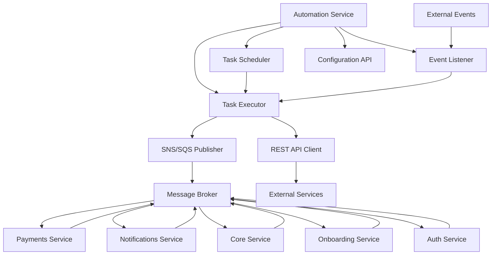
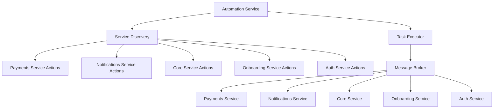

# Automation Service Design Document

## 1. System Overview

The Automation Service will be a central orchestration system that executes tasks across multiple microservices, either triggered by events (via SNS/SQS) or scheduled periodically. It will provide a REST API for task configuration and management. For internal service communication, we'll use message brokers instead of REST APIs.



## 2. Core Entities

### 2.1 Task

The central entity in the system, representing a unit of work to be executed.

**Key Properties:**
- ID: Unique identifier
- Name: Human-readable name
- Description: Detailed description
- Type: Event-driven or Scheduled
- TriggerConfig: Configuration for when the task should run
- ActionConfig: Configuration for what the task should do
- Conditions: Rules that determine if the task should execute
- Metadata: Additional information about the task
- Enabled: Whether the task is active
- RetryConfig: Configuration for retry behavior
- Execution status tracking: Last execution time, status, etc.

### 2.2 TriggerConfig

Defines when a task should be executed.

**For Event-Driven Tasks:**
- EventSource: The source of the event (SNS topic, SQS queue)
- EventTypes: Types of events that should trigger this task

**For Scheduled Tasks:**
- Schedule Type: hourly, daily, weekly, monthly, quarterly, yearly, custom
- Interval: Run every X hours/days/etc.
- Time specifications: Day of week, day of month, month, hour, minute
- CronExpression: For custom scheduling

### 2.3 ActionConfig

Defines what a task should do when executed.

**Key Properties:**
- ActionType: sns, sqs, rest, etc.
- Target: Topic ARN, Queue URL, API endpoint
- Payload: Data to send
- MessageAttributes: Additional metadata for message broker actions
- Headers: HTTP headers for REST actions (external services only)
- Authentication: Auth configuration for REST actions (external services only)

### 2.4 Condition

Rules that determine if a task should execute.

**Key Properties:**
- Field: The data field to evaluate
- Operator: Comparison operator (eq, neq, gt, lt, contains, etc.)
- Value: The value to compare against
- Source: Where to get the field from (event, context, etc.)

### 2.5 TaskExecution

Records of task execution attempts.

**Key Properties:**
- ID: Unique identifier
- TaskID: Reference to the task
- Status: running, completed, failed
- StartedAt: When execution began
- CompletedAt: When execution finished
- ErrorMessage: Details if execution failed
- InputData: Data provided to the task
- OutputData: Results of the task execution
- AttemptNumber: For retry tracking

## 3. Core Components

### 3.1 Event Listener

**Responsibilities:**
- Subscribe to SNS topics and SQS queues
- Parse incoming events
- Match events to tasks
- Evaluate conditions
- Enqueue matching tasks for execution

### 3.2 Task Scheduler

**Responsibilities:**
- Manage periodic tasks
- Schedule tasks based on their configuration
- Enqueue tasks when their scheduled time arrives

### 3.3 Task Executor

**Responsibilities:**
- Process tasks from the queue
- Execute the configured actions
- Handle retries for failed tasks
- Record execution history

### 3.4 Configuration API

**Responsibilities:**
- Provide endpoints for managing tasks
- Validate task configurations
- Update the scheduler when tasks change

## 4. Database Schema

### 4.1 Tasks Table

Stores task definitions and their current state.

**Key Fields:**
- id (PK)
- name
- description
- type
- trigger_config (JSON)
- action_config (JSON)
- conditions (JSON)
- metadata (JSON)
- enabled
- retry_config (JSON)
- created_at
- updated_at
- last_executed_at
- execution_status

### 4.2 Task Executions Table

Records the history of task executions.

**Key Fields:**
- id (PK)
- task_id (FK)
- status
- started_at
- completed_at
- error_message
- input_data (JSON)
- output_data (JSON)
- attempt_number

## 5. API Endpoints

### 5.1 Task Management

#### GET /api/tasks
- List all tasks
- Supports filtering, pagination, and sorting
- Returns: Array of Task objects

#### GET /api/tasks/{id}
- Get a specific task by ID
- Returns: Task object

#### POST /api/tasks
- Create a new task
- Body: Task object (without ID)
- Returns: Created Task object

#### PUT /api/tasks/{id}
- Update an existing task
- Body: Task object
- Returns: Updated Task object

#### DELETE /api/tasks/{id}
- Delete a task
- Returns: Success message

#### POST /api/tasks/{id}/enable
- Enable a task
- Returns: Updated Task object

#### POST /api/tasks/{id}/disable
- Disable a task
- Returns: Updated Task object

#### POST /api/tasks/{id}/execute
- Execute a task manually
- Returns: TaskExecution object

### 5.2 Task Execution History

#### GET /api/tasks/{id}/executions
- Get execution history for a task
- Supports pagination
- Returns: Array of TaskExecution objects

#### GET /api/executions
- Get execution history across all tasks
- Supports filtering, pagination, and sorting
- Returns: Array of TaskExecution objects

#### GET /api/executions/{id}
- Get a specific execution by ID
- Returns: TaskExecution object

### 5.3 System Management

#### GET /api/system/status
- Get system status
- Returns: Status information

#### POST /api/system/reload
- Reload task configurations
- Returns: Success message

## 6. Message Broker Topics and Queues

### 6.1 Command Topics (For Automation Service to Send Commands)

#### payments-commands
- Purpose: Send commands to the Payments Service
- Message Types:
  - `initiate-payment`
  - `process-refund`
  - `cancel-subscription`
  - `update-payment-method`

#### notifications-commands
- Purpose: Send commands to the Notifications Service
- Message Types:
  - `send-email`
  - `send-sms`
  - `send-push-notification`
  - `send-batch-notifications`

#### core-commands
- Purpose: Send commands to the Core Service
- Message Types:
  - `create-transaction`
  - `update-wallet-balance`
  - `create-ledger-entry`
  - `reconcile-accounts`

#### onboarding-commands
- Purpose: Send commands to the Onboarding Service
- Message Types:
  - `initiate-kyc`
  - `verify-documents`
  - `update-user-status`
  - `send-onboarding-reminder`

#### auth-commands
- Purpose: Send commands to the Auth Service
- Message Types:
  - `lock-account`
  - `unlock-account`
  - `reset-password`
  - `update-security-settings`

### 6.2 Event Topics (For Services to Publish Events)

#### payments-events
- Purpose: Receive events from the Payments Service
- Event Types:
  - `payment-initiated`
  - `payment-completed`
  - `payment-failed`
  - `refund-processed`
  - `subscription-renewed`
  - `subscription-canceled`

#### notifications-events
- Purpose: Receive events from the Notifications Service
- Event Types:
  - `notification-sent`
  - `notification-delivered`
  - `notification-failed`
  - `template-updated`

#### core-events
- Purpose: Receive events from the Core Service
- Event Types:
  - `transaction-created`
  - `transaction-completed`
  - `wallet-balance-changed`
  - `ledger-entry-created`
  - `account-reconciled`

#### onboarding-events
- Purpose: Receive events from the Onboarding Service
- Event Types:
  - `user-registered`
  - `kyc-initiated`
  - `kyc-completed`
  - `document-verified`
  - `onboarding-completed`

#### auth-events
- Purpose: Receive events from the Auth Service
- Event Types:
  - `user-logged-in`
  - `user-logged-out`
  - `password-changed`
  - `account-locked`
  - `account-unlocked`
  - `security-alert`

## 7. Service Action Discovery

### 7.1 Overview

Each microservice will expose a standardized endpoint that provides metadata about the actions it can perform. This will allow the Automation Service to dynamically discover available actions and their required parameters, making task configuration more robust and reducing the need for hardcoded knowledge about each service.



### 7.2 Action Registry Endpoint

Each microservice will implement a standard REST endpoint to expose its available actions:

```
GET /api/actions
```

This endpoint will return a list of actions the service can perform, along with their required parameters and schemas.

### Example Response:

```json
{
  "service": "payments-service",
  "version": "1.0.0",
  "actions": [
    {
      "id": "initiate-payment",
      "name": "Initiate Payment",
      "description": "Initiates a new payment transaction",
      "category": "Payments",
      "parameterSchema": {
        "type": "object",
        "required": ["userId", "amount", "currency", "paymentMethodId"],
        "properties": {
          "userId": {
            "type": "string",
            "description": "User ID"
          },
          "amount": {
            "type": "number",
            "description": "Payment amount"
          },
          "currency": {
            "type": "string",
            "description": "Currency code (ISO 4217)",
            "enum": ["USD", "EUR", "GBP"]
          },
          "paymentMethodId": {
            "type": "string",
            "description": "Payment method identifier"
          },
          "description": {
            "type": "string",
            "description": "Payment description"
          }
        }
      },
      "resultSchema": {
        "type": "object",
        "properties": {
          "paymentId": {
            "type": "string",
            "description": "Generated payment ID"
          },
          "status": {
            "type": "string",
            "description": "Initial payment status",
            "enum": ["pending", "processing", "completed", "failed"]
          }
        }
      },
      "messageType": "initiate-payment",
      "topic": "payments-commands"
    }
  ],
  "events": [
    {
      "id": "payment-completed",
      "name": "Payment Completed",
      "description": "Triggered when a payment is successfully completed",
      "category": "Payments",
      "schema": {
        "type": "object",
        "properties": {
          "paymentId": {
            "type": "string",
            "description": "Payment ID"
          },
          "userId": {
            "type": "string",
            "description": "User ID"
          },
          "amount": {
            "type": "number",
            "description": "Payment amount"
          },
          "currency": {
            "type": "string",
            "description": "Currency code"
          },
          "completedAt": {
            "type": "string",
            "format": "date-time",
            "description": "Completion timestamp"
          }
        }
      },
      "topic": "payments-events"
    }
  ]
}
```

### 7.3 Action Registry Implementation

Each microservice will implement the action registry using a standardized approach:

1. Define a data structure for the action registry
2. Populate the registry with the service's actions and events
3. Expose the registry via a REST endpoint

### 7.4 Service Discovery in the Automation Service

The Automation Service will periodically poll each microservice's action registry endpoint to discover available actions and their schemas. This information will be stored in a local cache and used for:

1. Validating task configurations against action schemas
2. Providing available actions to the API

The service discovery component will:

1. Maintain a list of microservice URLs
2. Periodically fetch the action registry from each service
3. Update the local cache with the latest actions and events
4. Provide methods to look up actions by ID
5. Validate task parameters against action schemas

### 7.5 Task Execution with Dynamic Actions

The Task Executor will use the action registry to validate and execute tasks:

1. Look up the action in the service discovery cache
2. Validate the task parameters against the action schema
3. Create a message with the appropriate command type
4. Publish the message to the appropriate topic

### 7.6 API Endpoints for Action Discovery

The Automation Service will expose endpoints to access the discovered actions:

```
GET /api/available-actions
```

Returns a list of all available actions across all services.

```
GET /api/available-actions/{id}
```

Returns details about a specific action, including its parameter schema.

```
GET /api/available-events
```

Returns a list of all available events across all services.

## 8. Implementation Requirements for Microservices

Each microservice will need to implement:

1. **Action Registry Endpoint**: Expose the `/api/actions` endpoint that returns the service's action registry
2. **Action Registry Definition**: Define the available actions and their schemas
3. **Command Handlers**: Implement handlers for each action that process incoming messages
4. **Event Publishers**: Publish events when relevant state changes occur

## 9. Benefits of Service Action Discovery

1. **Decoupling**: The Automation Service doesn't need to know the implementation details of each microservice
2. **Self-Documentation**: Each service documents its own capabilities
3. **Discoverability**: New actions are automatically discovered without code changes
4. **Validation**: Task configurations can be validated against the action schemas
5. **Versioning**: Services can evolve their actions independently
6. **Consistency**: Standardized approach to defining and documenting actions

## 10. Implementation Effort Estimates

### Phase 1: Core Infrastructure

**Foundation:**
- Set up project structure: 8 hours
- Implement database schema: 16 hours
- Create basic entity models: 16 hours
- Set up CI/CD pipeline: 8 hours

**Core Components:**
- Implement Task Scheduler: 24 hours
- Implement Event Listener: 24 hours
- Implement basic Task Executor: 32 hours
- Set up basic Configuration API: 24 hours

**Total Phase 1 Effort: 152 hours (19 person-days)**

### Phase 2: Message Broker Integration

**Message Handling:**
- Set up SNS/SQS infrastructure: 16 hours
- Implement message publishing: 24 hours
- Implement message consumption: 24 hours
- Add message schema validation: 16 hours

**Task Execution:**
- Implement condition evaluation: 24 hours
- Add retry mechanism: 16 hours
- Implement execution logging: 16 hours
- Create test harness for message-based tasks: 24 hours

**Total Phase 2 Effort: 160 hours (20 person-days)**

### Phase 3: Configuration and Management

**API Development:**
- Implement complete Configuration API: 40 hours
- Add authentication and authorization: 24 hours
- Implement validation: 16 hours
- Create API documentation: 16 hours

**Management Features:**
- Implement execution history: 24 hours
- Add system monitoring: 24 hours
- Implement audit logging: 16 hours
- Create administrative tools: 32 hours

**Total Phase 3 Effort: 192 hours (24 person-days)**

### Phase 4: Service Discovery and Integration

**Service Discovery:**
- Implement service discovery mechanism: 24 hours
- Add action schema validation: 16 hours
- Implement action registry API: 16 hours
- Create service discovery tests: 16 hours

**Microservice Integration:**
- Integrate with Core Service: 32 hours
- Integrate with Auth Service: 32 hours
- Integrate with Payments Service: 32 hours
- Integrate with Notifications Service: 32 hours
- Create end-to-end workflows: 40 hours
- Implement complex conditions: 24 hours

**Total Phase 4 Effort: 264 hours (33 person-days)**

**Total Project Effort: 768 hours (96 person-days)**

## 11. Microservice Adaptation Effort Estimates

### Payments Service

**Action Registry:**
- Implement action registry endpoint: 8 hours
- Define action schemas: 16 hours

**Message Handling:**
- Set up SNS topics for payment events and commands: 8 hours
- Implement message schema validation: 8 hours
- Add correlation ID support: 4 hours

**Command Handlers:**
- Implement command handlers for payment operations: 24 hours
- Add event publishing for state changes: 16 hours
- Implement error handling and retries: 16 hours

**Testing and Documentation:**
- Create integration tests: 16 hours
- Document message schemas: 8 hours
- Implement monitoring for automated operations: 8 hours

**Total Payments Service Effort: 108 hours (13.5 person-days)**

### Notifications Service

**Action Registry:**
- Implement action registry endpoint: 8 hours
- Define action schemas: 16 hours

**Templating System:**
- Create notification templates: 16 hours
- Implement template management: 16 hours
- Add support for dynamic content: 16 hours

**Message Handling:**
- Implement command handlers for notification operations: 24 hours
- Add event publishing for notification events: 16 hours
- Create batch notification support: 16 hours

**Total Notifications Service Effort: 104 hours (13 person-days)**

### Core Service

**Action Registry:**
- Implement action registry endpoint: 8 hours
- Define action schemas: 16 hours

**Message Handling:**
- Set up SNS topics for wallet and ledger events and commands: 8 hours
- Implement message schema validation: 8 hours
- Add transaction correlation: 8 hours

**Command Handlers:**
- Implement command handlers for wallet and ledger operations: 32 hours
- Add event publishing for state changes: 24 hours
- Enhance security for automated operations: 16 hours

**Total Core Service Effort: 96 hours (12 person-days)**

### Onboarding Service

**Action Registry:**
- Implement action registry endpoint: 8 hours
- Define action schemas: 16 hours

**Message Handling:**
- Set up SNS topics for onboarding events and commands: 8 hours
- Implement message schema validation: 8 hours
- Add support for event-driven workflows: 16 hours

**Command Handlers:**
- Implement command handlers for onboarding operations: 24 hours
- Add event publishing for state changes: 16 hours
- Create support for automated follow-ups: 16 hours

**Total Onboarding Service Effort: 88 hours (11 person-days)**

### Auth Service

**Action Registry:**
- Implement action registry endpoint: 8 hours
- Define action schemas: 16 hours

**Message Handling:**
- Set up SNS topics for authentication events and commands: 8 hours
- Implement message schema validation: 8 hours
- Add correlation for cross-service tracking: 8 hours

**Command Handlers:**
- Implement command handlers for authentication operations: 24 hours
- Add event publishing for security events: 16 hours
- Create comprehensive audit logging: 16 hours

**Total Auth Service Effort: 80 hours (10 person-days)**

**Total Microservice Adaptation Effort: 476 hours (59.5 person-days)**

## 12. Security Considerations

The service will implement several security measures:

1. **Message Authentication**: Ensure all messages between services are authenticated and authorized.

2. **Secure Credential Storage**: Sensitive information like API keys and passwords will be stored securely using environment variables or a secrets manager.

3. **Input Validation**: All inputs from events and API requests will be validated to prevent injection attacks.

4. **Audit Logging**: All configuration changes and task executions will be logged for audit purposes.

5. **Message Encryption**: Sensitive data in messages will be encrypted.

6. **Rate Limiting**: Implement rate limiting to prevent abuse of automated processes.

7. **Execution Isolation**: Ensure that task execution is properly isolated to prevent cascading failures.

## 13. Monitoring and Observability

The service will include comprehensive logging and monitoring:

**Execution Logging:**
- Record all task executions
- Store input and output data
- Track execution time and status

**Metrics:**
- Task execution counts (total, success, failure)
- Execution duration
- Retry counts
- Queue size
- Message processing rates

**Alerting:**
- Alert on repeated task failures
- Alert on system errors
- Alert on queue backlog
- Alert on message processing delays

**Dashboards:**
- Task execution overview
- Service health
- Error rates
- Performance metrics
- Message flow visualization

## 14. Conclusion

This automation service will provide a flexible and powerful way to automate tasks across your microservices architecture. By leveraging message brokers for internal service communication, we achieve better decoupling, scalability, and reliability compared to direct REST API calls.

The service is designed to be:
- **Flexible**: Supporting both event-driven and scheduled tasks
- **Reliable**: With configurable retry mechanisms
- **Scalable**: Using queue-based processing
- **Maintainable**: With a clean separation of concerns
- **Observable**: With comprehensive logging and monitoring

The implementation effort estimates indicate a total of approximately 768 hours (96 person-days) for the Automation Service itself, plus an additional 476 hours (59.5 person-days) for adapting the existing microservices to integrate with the automation platform.

The service action discovery mechanism will significantly enhance the flexibility and maintainability of the system by allowing each microservice to expose its available actions and their schemas, creating a more dynamic and self-documenting system that can adapt to changes without requiring code changes in the Automation Service.
